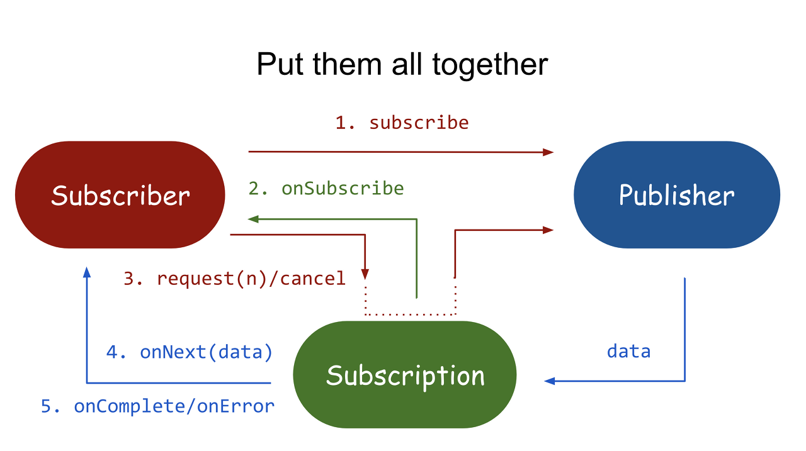

## Reactor

> 참고링크
> - [사용하면서 알게 된 Reactor, 예제 코드로 살펴보기](https://tech.kakao.com/posts/350)
> - [Reactive Stream과 구현체 : Project Reactor, RxJava, WebFlux](https://eocoding.tistory.com/104)
> - [옵저버(Observer) 패턴 - 완벽 마스터하기](https://inpa.tistory.com/entry/GOF-%F0%9F%92%A0-%EC%98%B5%EC%A0%80%EB%B2%84Observer-%ED%8C%A8%ED%84%B4-%EC%A0%9C%EB%8C%80%EB%A1%9C-%EB%B0%B0%EC%9B%8C%EB%B3%B4%EC%9E%90)
 

### Reactive Streams
논블로킹 백프레셔를 이용한 비동기 데이터 처리의 표준

#### 구성
1. Publisher
2. Subscriber
3. Subscription

#### Reactive Stream의 사용 흐름
1. Subscriber가 subscribe()를 통해 Publisher에게 구독을 요청하고
2. Publisher는 onSubscribe()를 통해 Subscriber에게 Subscription을 전달하고
3. Subscription은 Subscriber - Publisher 간 통신 매개체가 된다.   
   즉 Subscriber는 Publisher에게 직접 데이터 요청을 하지 않고 Subscription의 request 함수를 통해 Publisher에게 전달한다.
4. Publisher는 Subscription을 통해 Subscriber의 onNext()에 데이터를 전달하고, 작업이 완료되면 onComplete, 에러가 발생하면 onError 시그널을 전달한다.
5. Subscriber와 Publisher, Subscription이 서로 유기적으로 연결되어 통신을 주고받으면서 subscribe 부터 onComplete 까지 연결되고, 이를 통해 백프레셔가 완성된다.

#### 스트리밍 처리
입력 데이터에 대한 파이프 라인을 만들어서 데이터가 들어오는 대로 물 흘듯이 구독(subscribe)하고, 처리(process)한 뒤 발행(publish)까지 한번에 연결해서 처리한다.   

~~스트리밍 처리가 아닌 데이터 처리방식에서는 , 입력(요청) 데이터를 모두 받아 적재한 후에야 다음 처리한다.~~ 

#### 비동기 방식

#### 백 프레셔(push 방식, pull 방식)

1. 푸시 방식: 옵저버 패턴에서는 발행자가 구독자에게 밀어 넣는 푸시 방식으로 데이터가 전달됨. 발행자는 구독자의 상태를 고려하지 않고 데이터를 전달하는 데에만 충실하므로, 만약 발행자의 속도를 구독자의 처리 속도가 따라가질 못한다면 버퍼에 계속 쌓일 것이다. 그러다가 버퍼에 오버플로가 발생할 수 있다.
2. 풀 방식: 풀 방식에선 구독자가 10개를 처리할 수 있다면 10개만 딱 요청할 수 있다. 그러면 발행자는 요청받은 만큼만 전달하고, 구독자는 더 이상 out of memory 에러를 걱정하지 않아도 된다.
   -> 전달되는 모든 데이터의 크기를 구독자가 결정한다.
3. 백프레셔(= 다이나믹 풀 방식): 구독자가 현재 수용할 수 있는 만큼의 데이터만 요청하는 게 백프레셔 방식이다.

### RxJava vs Reactor
Pivotal의 오픈소스 프로젝트로, JVM 위에서 동작하는 논블럭킹 애플리케이션을 만들기 위한 리액티브 라이브러리입니다. Reactor는 RxJava 2와 함께 Reactive Stream의 구현체이기도 하고, Spring Framework 5부터 리액티브 프로그래밍을 위해 지원되는 라이브러리입니다.

#### publisher interface 구현체
- RxJava > Single, Maybe, Observable, Flowable 
- Reactor > Mono, Flux

### 옵저버 패턴
관찰 대상(Subject)과 관찰자(Observer)가 있고, Subject에 변화가 생겼을 때 알려야하는 Observer들에게 변경사항을 알리고 처리한다.

#### Pub-Sub 패턴과 차이점
변경 event를 발생시키는 component(Publisher 또는 Subject)와 관찰자(Subscriber 또는 Observer)가 서로 인지하는지 여부.   
pub-sub에서는 event channel(또는 broker) 가 pub 와 sub 중간에서 event 전달을 중계해주지만, observer 패턴에서는 직접 event를 전달한다.

~~다산 앱 리팩토링할 때 observer(RxAndroid) 많이 썼음.~~

