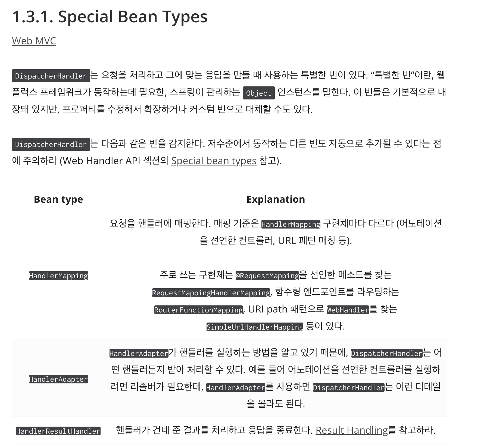

## Spring MVC vs Webflux

> 참고링크
> - _[토리맘-webflux](https://godekdls.github.io/Reactive%20Spring/springwebflux/#11-overview)_
> - _[토리맘-webflux2](https://godekdls.github.io/Reactive%20Spring/springwebflux2/)_

#### Q. webflux&netty 조합이 기본이다. 왜?
보통 비동기 논블로킹에 netty를 많이 사용하기도 하고, 클라이언트와 서버가 리소스를 공유할 수 있기때문이다.

#### Q. mvc&netty 조합, 언제쓰고 어떤 장점이 있을까?
#### Q. webflux&tomcat 조합, 언제쓰고 어떤 장점이 있을까?
mvc는 서블릿의 블로킹 I/O를 사용하는데,,

#### Q. reactive와 non-blocking 의 주된 이점
고정된 적은 쓰레드와 적은 메모리로도 확장이 가능하다는 것이다.

### 1.1.7 Concurrency Model
- mutable state: 상태공유 신경쓰지 않아도 된다.
- threading model
  - (Default) thread 1개로 서버 운영, CPU 코어 수 만큼의 thread로 요청 처리함.
  - tomcat은 아마 10개..?

### 1.2 Reactive Core
#### HttpHandler vs WebHandler API 
->  WebHandler API 사용함.
-> @Controller 사용하지 않고 config에서 router에 handler mapping 하는 방식을 사용했다.   
간단하고 관리포인트가 DispatcherHandler 하나라 편함.   
모든 endpoint들을 메서드별 권한까지 다 한 파일에서 관리해서 좋았다.   

